# PurrFectAiApp: Autonomous Trading AI Agent System Design Document

## 1. System Overview

PurrFectAiApp is an autonomous trading system specialized for meme coin trading that leverages real-time market data, social signals, and on-chain analytics to execute trades on behalf of users while generating revenue through exchange rebates.

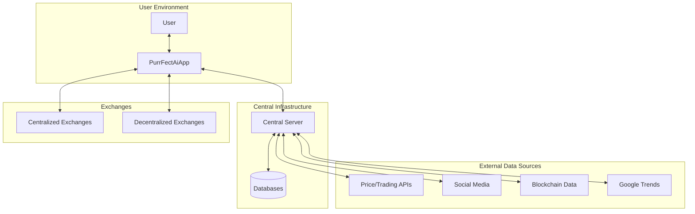

## 2. Core Components

### 2.1 PurrFectAiApp (Client-Side)

The desktop application installed on users' computers that provides the interface for interaction and executes trading strategies.

#### 2.1.1 Key Components

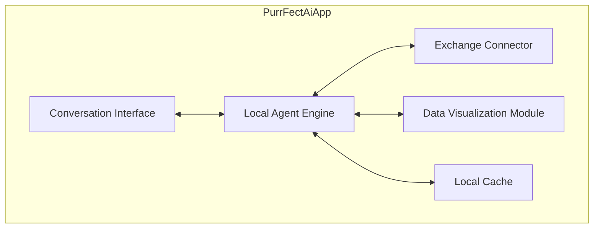

| Component | Description | Responsibilities |
|-----------|-------------|------------------|
| **Conversation Interface** | Natural language interface for user interaction | Process user commands, display AI responses, capture trading preferences |
| **Local Agent Engine** | Core decision-making component | Execute trading strategies, personalize decisions, manage risk parameters |
| **Exchange Connector** | Integration with trading platforms | Secure API key storage, order execution, position monitoring |
| **Data Visualization Module** | Visual representation of data | Portfolio tracking, trade history, market trends visualization |
| **Local Cache** | Local data storage | Store recent market data, user preferences, trading history |

#### 2.1.2 Functional Capabilities

- Conversational configuration of trading parameters
- Autonomous trade execution based on signals
- Portfolio monitoring and visualization
- Secure management of exchange API credentials
- Offline functionality with limited capabilities

### 2.2 Central Server

The cloud-based infrastructure that collects, processes, and distributes data and trading signals.

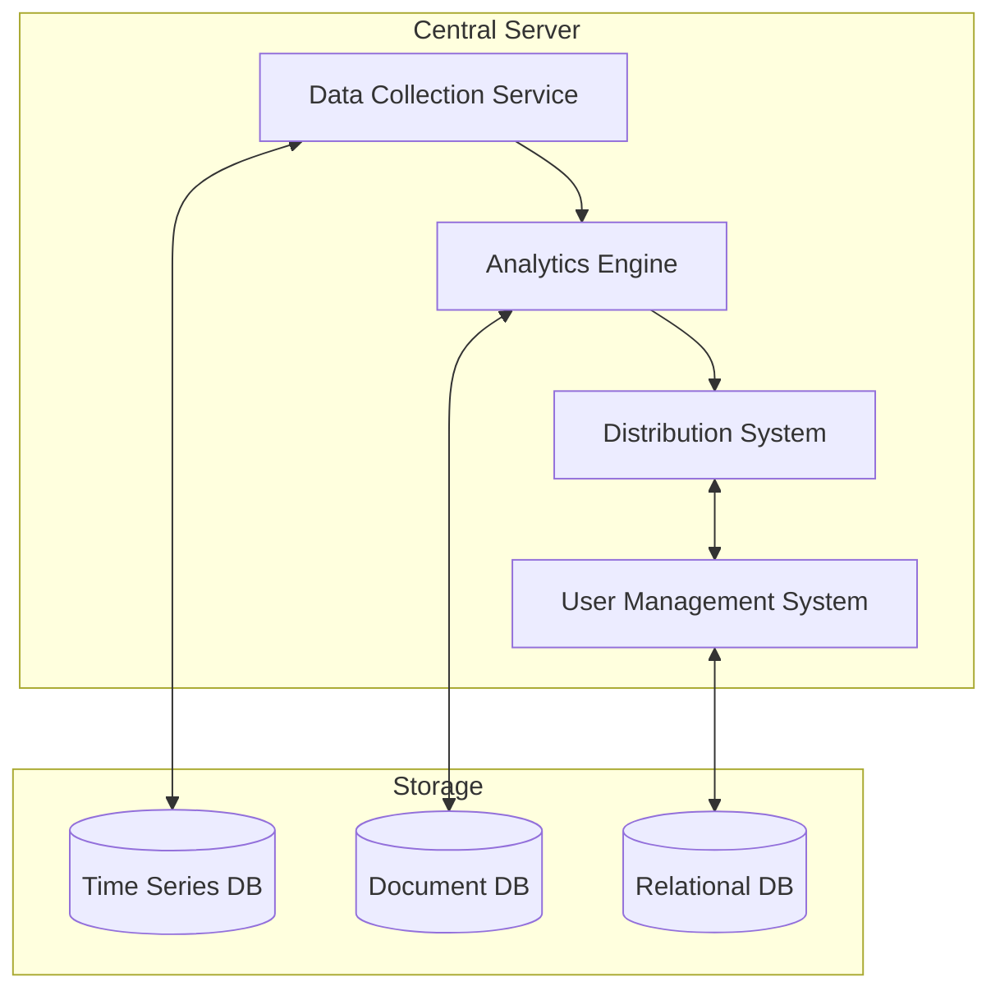

| Component | Description | Responsibilities |
|-----------|-------------|------------------|
| **Data Collection Service** | Aggregates data from external sources | API integration, data normalization, scheduled collection |
| **Analytics Engine** | Processes raw data into actionable insights | Signal generation, trend identification, risk assessment |
| **Distribution System** | Delivers insights to client applications | Real-time updates, authentication, access control |
| **User Management System** | Manages user accounts and tracking | Account management, usage analytics, rebate attribution |

#### 2.2.1 Data Sources Integration

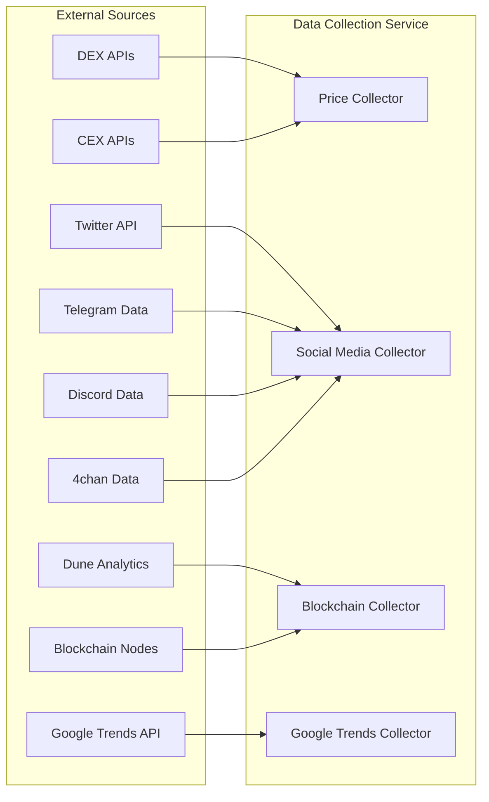

## 3. Data Flow Architecture

### 3.1 Overall Data Flow

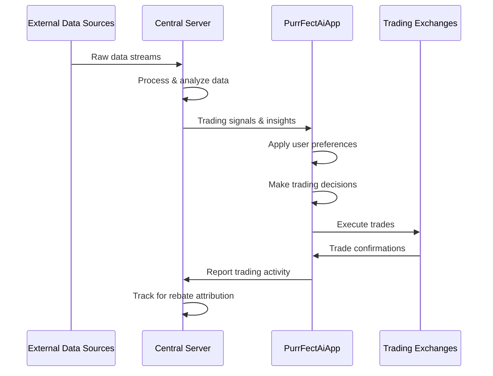

### 3.2 Signal Generation Process

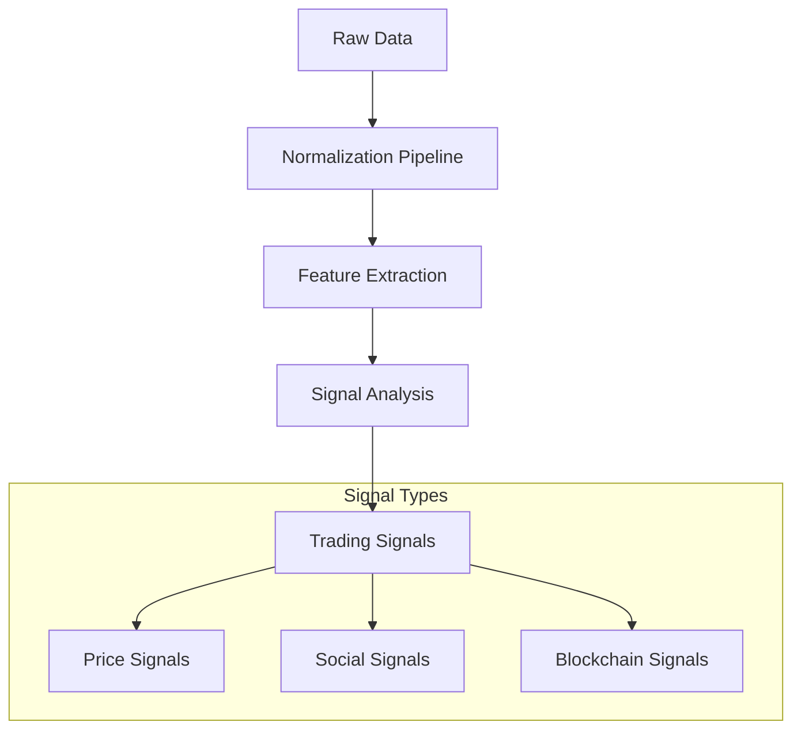

## 4. Autonomous Trading Mechanism

### 4.1 Decision Flow

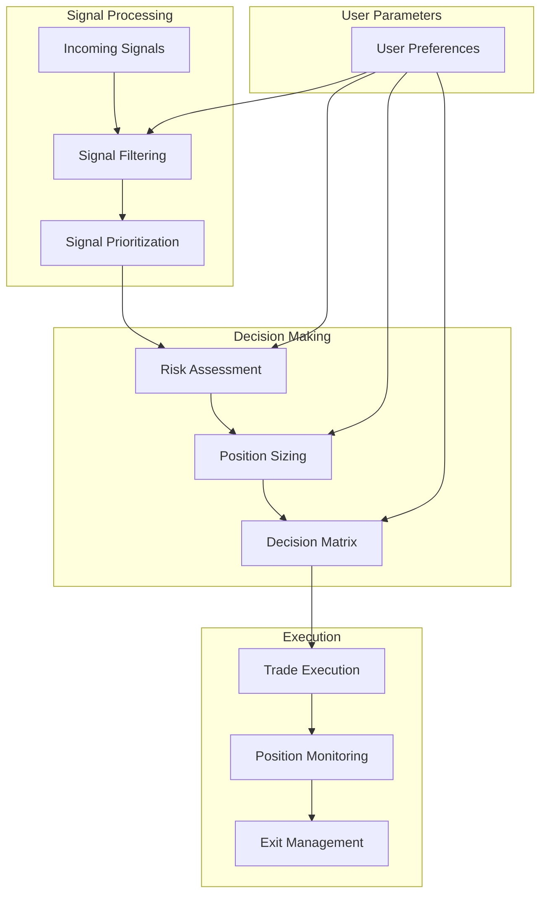

### 4.2 Conversation-Based Configuration

The system uses natural language processing to translate user preferences into trading parameters:

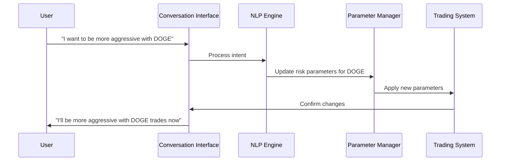

### 4.3 Default Trading Parameters

| Parameter | Default Value | Description |
|-----------|---------------|-------------|
| Allocation per trade | 5% of available balance | Maximum capital allocated to a single position |
| Risk/reward ratio | 2:1 | Target profit relative to stop loss |
| Maximum concurrent positions | 3 | Number of open positions allowed simultaneously |
| Total portfolio exposure | 15% | Maximum percentage of portfolio in meme coins |
| Stop loss | 7% | Default stop loss percentage |
| Take profit | 15% | Default take profit percentage |

## 5. Security Architecture

### 5.1 API Key Management

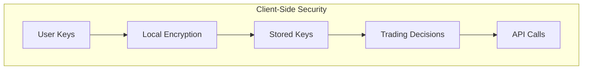

### 5.2 Data Protection

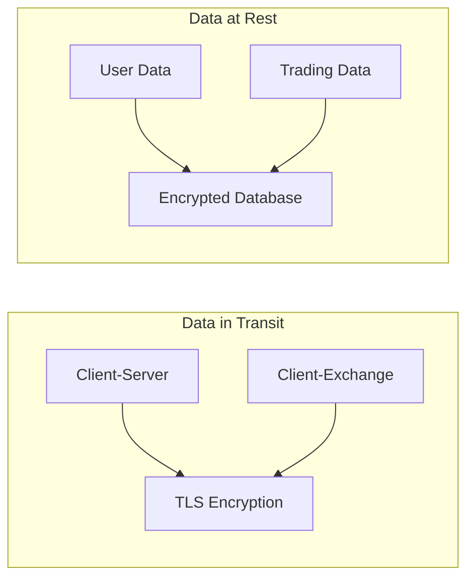

## 6. Scalability Design

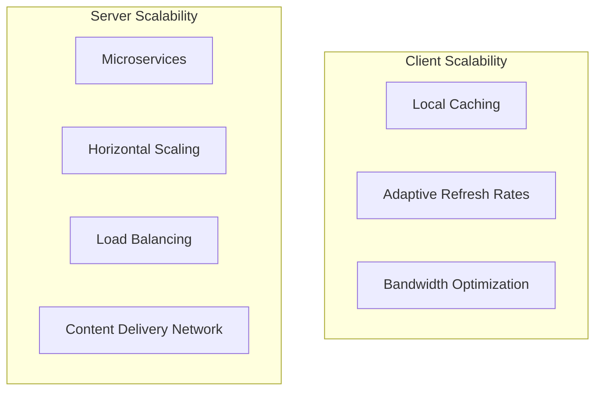

## 7. Revenue Model

### 7.1 Exchange Rebate Flow

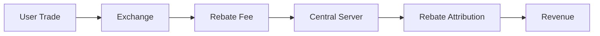

### 7.2 Potential Future Revenue Streams

| Revenue Stream | Description | Implementation Timeline |
|----------------|-------------|-------------------------|
| Premium features | Advanced signals and higher automation | Q3 2023 |
| Success fees | Optional percentage of profitable trades | Q4 2023 |
| White-label solution | Licensed platform for trading groups | Q1 2024 |

## 8. Implementation Roadmap

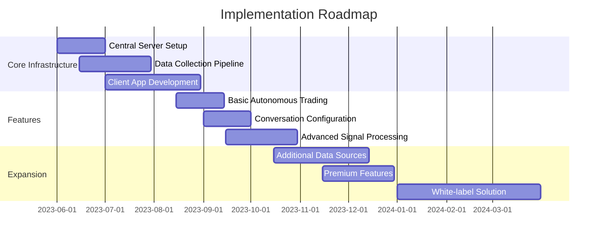

## 9. Technical Stack Recommendations

### 9.1 Client Application

| Component | Technology Options | Rationale |
|-----------|-------------------|-----------|
| Framework | Electron, React Native | Cross-platform desktop support |
| State Management | Redux, MobX | Predictable state management |
| Local Database | SQLite, IndexedDB | Efficient local storage |
| NLP Processing | TensorFlow.js, Compromise | On-device language processing |

### 9.2 Central Server

| Component | Technology Options | Rationale |
|-----------|-------------------|-----------|
| Backend | Node.js, Python | Efficient async processing |
| API | GraphQL, REST | Flexible data querying |
| Databases | TimescaleDB, MongoDB, PostgreSQL | Specialized for different data types |
| Real-time | WebSockets, Socket.io | Low-latency updates |
| Deployment | Docker, Kubernetes | Scalable containerization |

## 10. Risk Management

### 10.1 Technical Risks

| Risk | Mitigation Strategy |
|------|---------------------|
| API rate limiting | Implement caching and rate limit management |
| Exchange downtime | Multi-exchange support with fallback options |
| Data accuracy | Multiple data source validation |
| System outages | Graceful degradation with local functionality |

### 10.2 Trading Risks

| Risk | Mitigation Strategy |
|------|---------------------|
| Market volatility | Adaptive position sizing and stop-loss management |
| False signals | Multi-factor confirmation requirements |
| User overrides | Clear warning system for high-risk actions |
| Regulatory changes | Compliance monitoring and adaptable architecture |

## 11. Conclusion

The PurrFectAiApp system provides a user-friendly, conversation-driven autonomous trading experience for meme coin traders while generating revenue through exchange rebates. By balancing processing between the client application and central server, the system delivers powerful capabilities with a simple user experience.

The architecture prioritizes:
1. Ease of use through conversational configuration
2. Robust data collection and analysis
3. Secure and reliable trade execution
4. Scalable infrastructure for future growth

This design document serves as the foundation for implementation, with the understanding that iterative improvements will be made based on user feedback and market conditions. 

I had an idea of create a professional AI tool for crypto trader, like cursor for software engineer.  @design.md  is my initial design of this idea.  I'd like to create a product UI proto type for it.  I think it should include main, market, trade and config tab. each tab should has a wroksapce panel and a conversation panel.

